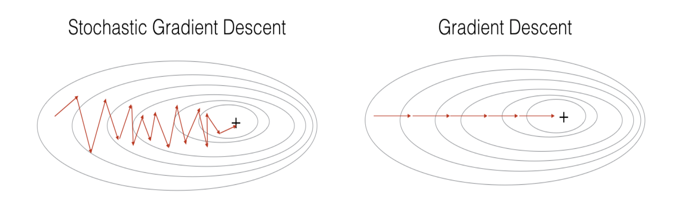
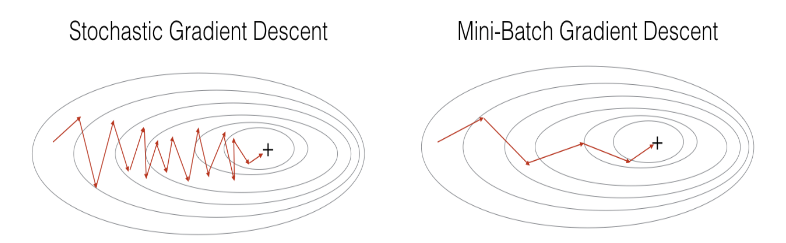

#### 1. (Batch) Gradient Descent

* All the training examples do gradient descent together

* Advantages: better performance

* Disadvantages: if dataset is too big, the training process will be slow

* Code example:

  ```python
  X = data_input
  Y = labels
  parameters = initialize_parameters(layers_dims)
  for i in range(0, num_iterations):
      # Forward propagation
      a, caches = forward_propagation(X, parameters)
      # Compute cost.
      cost += compute_cost(a, Y)
      # Backward propagation.
      grads = backward_propagation(a, caches, parameters)
      # Update parameters.
      parameters = update_parameters(parameters, grads)
  ```

#### 2. Stochastic Gradient Descent

* Computing gradients on just one training example at a time, rather than on the whole training set

* Advantages: speed up convergence

* Disadvantages: the parameters will "oscillate" toward the minimum rather than converge smoothly

  

* Code example:

  ```python
  X = data_input
  Y = labels
  parameters = initialize_parameters(layers_dims)
  for i in range(0, num_iterations):
      for j in range(0, m):
          # Forward propagation
          a, caches = forward_propagation(X[:,j], parameters)
          # Compute cost
          cost += compute_cost(a, Y[:,j])
          # Backward propagation
          grads = backward_propagation(a, caches, parameters)
          # Update parameters.
          parameters = update_parameters(parameters, grads)
  ```

#### 3. Mini-batch Gradient Descent

* The number of training examples that do gradient descent at a time is $n (1\lt n\lt m)$

* If $n = 1$, it becomes stochastic gradient descent; if $n=m$, it becomes batch gradient descent

* Advantages: more smooth than SGD, faster than BGD

  

* Disadvantages: one more hyper parameter **batch_size** need to be tuned

* Code example:

  * First, random mini batches

    ```python
    # GRADED FUNCTION: random_mini_batches
    
    def random_mini_batches(X, Y, mini_batch_size = 64, seed = 0):
        """
        Creates a list of random minibatches from (X, Y)
        
        Arguments:
        X -- input data, of shape (input size, number of examples)
        Y -- true "label" vector (1 for blue dot / 0 for red dot), of shape (1, number of examples)
        mini_batch_size -- size of the mini-batches, integer
        
        Returns:
        mini_batches -- list of synchronous (mini_batch_X, mini_batch_Y)
        """
        
        np.random.seed(seed)            # To make your "random" minibatches the same as ours
        m = X.shape[1]                  # number of training examples
        mini_batches = []
            
        # Step 1: Shuffle (X, Y)
        permutation = list(np.random.permutation(m))
        shuffled_X = X[:, permutation]
        shuffled_Y = Y[:, permutation].reshape((1, m))
        
        inc = mini_batch_size
    
        # Step 2 - Partition (shuffled_X, shuffled_Y).
        # Cases with a complete mini batch size only i.e each of 64 examples.
        num_complete_minibatches = math.floor(m / mini_batch_size) # number of mini batches of size mini_batch_size in your partitionning
        for k in range(0, num_complete_minibatches):
            # (approx. 2 lines)
            # mini_batch_X =  
            # mini_batch_Y =
            # YOUR CODE STARTS HERE
            mini_batch_X = shuffled_X[:, k * inc : (k+1) * inc]
            mini_batch_Y = shuffled_Y[:, k * inc : (k+1) * inc]
            # YOUR CODE ENDS HERE
            mini_batch = (mini_batch_X, mini_batch_Y)
            mini_batches.append(mini_batch)
        
        # For handling the end case (last mini-batch < mini_batch_size i.e less than 64)
        if m % mini_batch_size != 0:
            #(approx. 2 lines)
            # mini_batch_X =
            # mini_batch_Y =
            # YOUR CODE STARTS HERE
            mini_batch_X = shuffled_X[:, inc * num_complete_minibatches : m]
            mini_batch_Y = shuffled_Y[:, inc * num_complete_minibatches : m]
            # YOUR CODE ENDS HERE
            mini_batch = (mini_batch_X, mini_batch_Y)
            mini_batches.append(mini_batch)
        
        return mini_batches
    ```

  * Second, gradient descent

    ```python
    seed = 0
    for i in range(0, num_iterations):
        # Define the random minibatches. We increment the seed to reshuffle differently the dataset after each epoch
        seed = seed + 1
        minibatches = random_mini_batches(X, Y, mini_batch_size, seed)
        for minibatch in minibatches:
            # Select a minibatch
            (minibatch_X, minibatch_Y) = minibatch
            # Forward propagation
            AL, caches = forward_propagation(minibatch_X, parameters)
            # Compute cost
            cost = compute_cost(AL, minibatch_Y)
            # Backward propagation
            grads = backward_propagation(AL, minibatch_Y, caches)
            parameters = update_parameters(parameters, grads, learning_rate)
    ```
  
* **batch_size** usually is a power of two, which is more conducive to GPU acceleration

