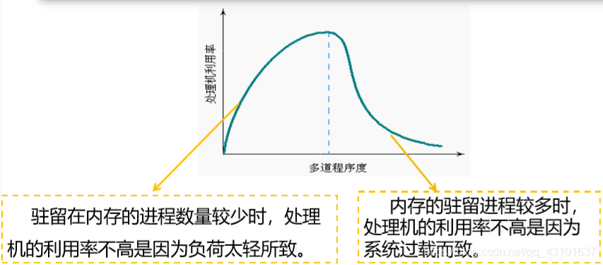

#### 1. 内存层次(Memory Hierarchies)

1. Computers typically have memory hierarchies: 
   - Registers, L1/L2/L3 cache (volatile)
   - Main memory (volatile)
   - Disks (nonvolatile)
   - 
2. **Higher memory** is faster, more expensive and volatile, **lower memory** is slower, cheaper and non-volatile.
3. Memory can be seen as one **linear array** of bytes/words.
   - 
4. **OS responsibilities:**
   - **Allocate/Deallocate** memory when requested by processes, **keep track of** **used/unused** memory.
   - **Transparently** move data from **memory** to **disk** and vice versa.
   - **Distribute memory** between processes and simulate an **"infinitely large"** memory space.
   - **Control access** when multiprogramming is applied.

#### 2. 操作系统的内存管理方式

1. 操作系统中采用的内存管理方式
   - 重定位(relocation)
   - 分段(segmentation)
   - 分页(paging)
   - 虚拟存储(virtual memory)
2. 实现高度依赖硬件
   - 与计算机存储架构紧耦合
   - MMU(内存管理单元): 处理CPU存储访问请求的硬件

#### 3. 地址空间和地址生成

1. 地址空间定义:
   - 物理地址空间——硬件支持的地址空间
     - 起始地址为0，直到MAXsys
   - 逻辑地址空间——在CPU运行的进程看到的地址
     - 起始地址为0，直到MAXprog
2. 逻辑地址生成
   - 
3. 地址生成时机和限制
   - 编译时
     - 假设起始地址已知
     - 如果起始地址改变，必须重新编译
   - 加载时
     - 如编译时起始位置未知，编译器需生成可重定位的代码(relocatable code)
     - 加载时，生成绝对地址
   - 执行时
     - 执行时代码可移动
     - 需地址转换(映射)硬件支持
4. 地址生成过程
   - CPU
     - ALU: 需要逻辑地址的内存内容
     - MMU: 进行逻辑地址和物理地址的转换
     - CPU控制逻辑: 给总线发送物理地址请求
   - 内存
     - 发送物理地址的内容给CPU
     - 或接收CPU数据到物理地址
   - 操作系统
     - 建立逻辑地址LA和物理地址PA的映射
5. 地址检查
   - 

#### 4. Contiguous Memory (连续内存)

1. Mono-programming(单道程序)

   - Only **one single user process** is in memory/executed at any point in time (no multi-programming)
   - A fixed region of memory is allocated to the **OS/kernel**, the remaining memory is reserved for a **single process** (MS-DOS worked this way) 
   - This process has **direct access** to **physical memory** (i.e. no address translation takes place) 
   - Every process is allocated **contiguous block of memory**, i.e. it contains no "holes" or "gaps" (⇔ **non-contiguous allocation**)
   - **One process** is allocated the **entire memory space**, and the process is **always located in the same address space**
   - **No protection** between different user processes required (one process)
   - **Overlays** enable the programmer to use more memory than available (burden on programmer)
   - **Shortcomings** of Mono-programming:
     - Since a process has **direct access to the physical memory**, it may have **access to OS** memory
     - The operating system can be seen as a process - so we have **two processes** anyway
     - **Low** **utilisation** of hardware resources (CPU, I/O devices, etc.)
     - Mono-programming is unacceptable as **multiprogramming is expected** on modern machines
   - Direct memory access and mono-programming is common in basic **embedded systems** and **modern consumer electronics**, e.g. washing machines, microwaves, etc.

2. Multi-programming(多道程序): **A Probabilistic Model**(概率模型)

   - There are **n independent processes in memory**
   - A process spends **p percent** of its time **waiting for I/O**
   - **CPU** **Utilisation** is calculated as 1 minus the time that **all processes are waiting for I/O:** e.g., p = 0.9 then CPU utilisation = 1 - 0.9 ⇒ 0.1 => (1−p)
   - The **probability** that all n processes are waiting for I/O (i.e., the CPU is idle) is pn , i.e. p ×p ×p . . . 
   - The **CPU** **utilisation** is given by 1−pn
   - CPU **utilisation goes up** with **the number of processes** and down for **increasing levels of I/O ratio**
   - Muiti-programming does able to improve resource utilisation

3. Fixed partitions (固定分区)

   - Divide memory into **static, contiguous and equal sized partitions** that have a **fixed size** and **fixed location** (静态大小相等分区)

     - Any process can take up **any** (large enough) **partition**
     - Allocation of **fixed equal sized partitions** to processes is **trivial**
     - Very **little overhead** and **simple implementation**
     - The operating system keeps a track of which partitions are being **used** and which are **free**

   - **Disadvantages** of static equal-sized partitions

     - **Low memory utilisation** and **internal fragmentation**: partition may be unnecessarily large
     - **Overlays** must be used if a program does not fit into a partition (burden on programmer)

   - Divide memory into **static** and **non-equal sized partitions** that have a **fixed size** and **fixed location** (静态大小不等分区)

     - **Reduces internal fragmentation**
     - The **allocation** of processes to partitions must be **carefully considered**

   - Allocation Methods

     1. **One private queue per partition**

     - Assigns each process to the **smallest partition** that it would fit in
     - **Reduces internal fragmentation**
     - Can **reduce memory utilisation** (e.g., lots of small jobs result in unused large partitions) and result in **starvation**

     1. **A single shared queue** for all partitions can allocate small processes to **large partitions** but results in **increased internal fragmentation**

   - **Cons** of fixed partitioning

     - Limits the number of **active processes (overlays)**
     - Small job not **utilize partition space efficiently** (internal fragmentation)
     - Processes' memory requirement need to be **known beforehand**.

4. Dynamic partitioning (动态分区)

   - **Fixed partitioning** results in **internal fragmentation**:
     - An **exact match** between the requirements of the process and the available partitions **may not exist**
     - The partition **may not be used entirely**
   - Dynamic partitioning
     - A **variable number of partitions** of which the **size** and **starting address** **can change** over time
     - A process is allocated the **exact amount of contiguous memory** it requires, thereby **preventing internal fragmentation**

- Swapping
  - **Swapping** holds some of the **processes on the hard disk** and **shuttles processes** between the hard disk and main memory as necessary
- **Reasons** for swapping:
  - Some **processes** only **run occasionally**
  - We have **more processes** than **partitions** (assuming fixed partitions)
  - A process's **memory requirements** have **changed**, e.g. increased
  - The **total amount of memory that is required** for the processes **exceeds the available memory**
- Allocation structure: Bitmaps
  - The simplest data structure to **keep track of free memory** is a form of **bitmap**
  - **Memory** is **split into blocks** of say 4 kilobyte size
    - A bit map is set up so that **each bit** is **0** if the **memory block is free** and **1** if the **memory block is used**, e.g.
      - 32MB memory = 32 * 220 bytes / 4K blocks => 8192 bitmap entries
      - 8192 bits occupy 8192 / 8 = 1K bytes of storage
    - The size of this bitmap will depend on the **size of the memory** and the **size of the allocation unit**
  - A **trade-off exists** between the **size of the bitmap** and the **size of blocks**
    - The **size of bitmaps** can become prohibitive for small blocks and may **make searching** the bitmap **slower**
    - Larger blocks may increase **internal fragmentation**
  - **Bitmaps** are **rarely used** for this reason
- Allocation structure: Linked List
  - A more **sophisticated data structure** is required to deal with **a variable number** of **free and used partitions**
  - **A linked list** is one such possible data structure
    - A linked list consists of a **number of entries** ("links")
    - Each link **contains data items**, e.g. **start of memory block**, **size**, free/allocated **flag**
    - Each link also contains a **pointer to the next** in the chain
  - 

1. The operating system is responsible for:
   - Applying strategies to (quickly) **allocate processes** to available memory ("holes")
   - Managing **free space**
2. Allocating Available Memory: Algorithms
   - **First fit** starts scanning **from the start** of the linked list until a link is found which represents **free space of sufficient size**
     - If requested space is **the exact same size** as the "hole", all the space is allocated (i.e. no **internal** fragmentation)
     - Else, the free link is **split into two**:
       - The first entry is set to the **size requested** and marked **"used"**
       - The second entry is set to **remaining size** and marked **"free"**
   - The **next fit algorithm** maintains a record of where it got to:
     - It **starts its search** from **where it stopped last time**
     - It gives an **even chance to all memory to get allocated** (first fit concentrates on the start of the list)
     - However, simulations have shown that next fit actually gives **worse performance** than first fit
   - Best fit:
     - **First fit** just looks for the **first available hole**
       - It doesn't take into account that there may be **a hole later** in the list that **exactly(-ish)** fits the requested size
       - First fit **may break up a big hole** when the right size hole exists later on
     - **Next fit** doesn't improve that model
     - The **best fit algorithm** always **searches the entire linked list** to find the **smallest hole big enough** to satisfy the memory request
       - It is **slower** than first fit
       - It also results in **more wasted memory** (memory is more likely to fill up with tiny-useless-holes, first fit generates larger holes on the average)
   - Worst fit:
     - **Tiny holes** are created when **best fit** splits an empty partition
     - The **worst fit algorithm** finds the **largest available empty partition** and splits it
       - The **left over part will still be large** (and **potentially more useful**)
       - Simulations have also shown that worst fit is **not very good either**
   - Summary:
     - **First fit**: allocate **first block** that is **large enough**
     - **Next fit**: allocate **next block** that is large enough, i.e. **starting from the current location**
     - **Best fit**: choose block that **matches** required size **closet** - O(N) complexity
     - **Worst fit**: choose the **larget possible block** - O(N) complexity
   - Quick fit and others:
     - **Quick fit** maintains **lists of commonly used sizes**
       - For example a separate list for each of 4K, 8K, 12K, 16K, etc. holes
       - **Odd sizes** can either go into the **nearest size** or into a **special separate list**
     - It is **much faster** to find the required size holes using **quick fit** (table of entries, entries point to head of holes)
     - Similar to next fit, it has the problem of creating **many tiny holes**
     - Finding neighbours for **coalescing** (combining empty partitions) becomes more difficult/time consuming
3. Managing Available Memory: Coalescing
   - **Coalescing** (joining together) takes place when two **adjacent entries** in the linked list **become free**
     - There may be three adjacent free entries if a used block in-between two free blocks is freed
   - Both **neighbours** are examined when a **block is freed**
     - If either (or both) are **also free**
     - Then the two (or three) **entries are combined** into one larger block by adding up the sizes
       - The earlier block in the linked list gives the **start point**
       - The **separate links are deleted** and a single link inserted
4. Managing Available Memory: Compacting (紧凑)
   - Even with coalescing happening automatically, **free blocks** may still **distributed across memory**
     - => **Compacting** can be used to join free and used memory (but is **time consuming**)
   - **Compacting is more difficult and time consuming** to implement than coalescing (processes have to be moved)
     - Each process is **swapped out** & **free space coalesced**
     - Process swapped back in at lowest available location
   - 通过移动分配给进程的内存分区，以合并外碎片
   - 碎片紧凑的条件
     - 所有的应用程序可动态重定位
5. Difficulties of Dynamic Partitioning
   - The exact **memory requirements** may **not be known** in advance (**heap** and **stack** grow dynamically)
   - **External fragmentation**
     - **Swapping** a process out of memory will create a **"hole"**
     - A new process may not use the entire "hole", leaving a small **unused block**
     - A new process may be **too large** for a given "hole"
   - The **overhead** of memory **compaction** to **revocer holes** can be **prohibitive** and requires **dynamic relocation**
     - Requires a lot of CPU time
6. Overview and Shortcomings
   - Different contiguous memory allocation schemes have different advantages/disadvantages
     - **Mono-programming** is easy but does result in **low resource utilisation**
     - **Fixed partitioning** facilitates **multi-programming** but results in **internal fragmentation**
     - **Dynamic partitioning** facilitates **multi-programming**, reduces **internal fragmentation**, but results in **external fragmentation** (allocation methods, coalescing, and compacting help)

#### 5. Code relocation and protection

1. Principles:

- **Relocation**: when a program is run, it **does not know in advance** which **partition/address** it will occupy
  - The program cannot simply generate **static address** (e.g. jump instructions) that are **absolute**
  - Addresses should be **relative to where the program has been loaded**
  - **Relocation must be solved** in an operating system that allows processes to run at **changing memory locations (on the fly)**
- **Protection**: once you can have two programs in memory at the same time, protection must be enforced

1. Address Types

- A **logical address** is a memory address **seen by the process**
  - It is **independent** of the current **physical memory** assignment
  - It is, e.g., **relative to the start of the program**
- A **physical address** refers to an **actual location** in **main memory**
- The **logical address space** must be mapped onto the machine's **physical address space**

1. Approaches

- **Static "relocation" at compile time:** a process has to be located at the same location every single time (impractical)
- **Dynamic relocation** at **load time**
  - An **offset** is added to every logical address to **account for its physical location** in memory
  - **Slows down** the loading of a process, does not account for **swapping**
- **Dynamic relocation** at **runtime**
  - 每个CPU配置2个特殊的硬件寄存器，叫作**基址寄存器**和**界限寄存器**，当一个程序运行时，程序的起始物理地址装载到**基址寄存器**中，程序的长度装载到**界限寄存器**中，每次一个进程访问内存，取一条指令，读或写一个数据字，CPU硬件会在把地址发送到内存总线之前，自动把基址值加到进程发出的地址值上，同时，它检查程序提供的地址是否等于或大于界限寄存器里的值，如果地址超出界限，则产生错误并中止访问
  - Two special purpose registers are maintained in the CPU (the **MMU**), containing a **base address** and **limit**
    - The **base register** stores the **start address** of the partition
    - The **limit register** holds the **size** of the partition (end of program)
  - **At runtime:**
    - The **base register** is added to the **logical (relative) address** to generate the **physical address**
    - The resulting address is **compared** against the **limit address**
  - The Relocation also provides a measure of **protection**: each process image is **isolated** by the contents of the base and bounds registers and **safe from unwanted accesses** by other processes.
  - 缺点：
    - 每次访问内存都需要进行加法和比较运算，加法由于进位传递时间的问题，在没有使用特殊电路的情况下会显得很慢

#### 6. Non-Contiguous Memory (非连续内存)

1. Paging (分页)

- Principles
  - **Paging** uses the principles of **fixed partitioning** and **code re-location** to devise a new **non-contiguous management scheme:**
    - Memory is split into much **smaller blocks** and **one or more blocks** are allocated to a process
      - e.g., a 11kb process would take up 3 blocks of 4kb
    - These blocks **do not have to be contiguous in main memory**, but the process still **perceives them to be contiguous**
  - Benefits compared to contiguous schemes include:
    - **Internal fragmentation** is reduced to the **last "block"** only
    - There is **no external fragmentation**, since physical blocks are **stacked directly onto each other** in main memory
- Definitions
  - A **page** is a small block of **contiguous memory** in the **logical address space**, i.e. as seen by the process
  - A **page frame (页框)** is a **small contiguous block** in **physical memory**
  - Pages and frames (usually) have the **same size:**
    - The size is usually a power of 2
    - Sizes range between 512 bytes and 1Gb
- Relocation
  - **Logical address** (page number, offset within page) needs to be **translated** into a **physical address** (frame number, offset within frame)
  - **Multiple "base registers"** will be required:
    - Each logical page needs **a separate "base register"** that specifies the start of the associated frame
    - i.e., a **set of base registers** has to be maintained for each process
  - The base registers are stored in the **page table**
- Relocation: Page Tables
  - The page table can be seen as **a function**, that **maps the page number** of the logical address **onto the frame number** of the physical address
    - frameNumber = f(pageNumber)
  - The **page number** is used as **index to the page table** that lists the **number of associated frame**, i.e. it contains the location of the frame in memory
  - Every process has its **own page table** containing its own "base registers"
  - The **operating system** maintains a **list of free frames**
- Address Translation: Implementation
  - A **logical (physical) address** is relative to the start of the **program (memory)** and consists of two parts:
    - The **right most**  **bits** that represent the **offset within the page (frame)**
      - e.g. 12 bits fot the offset, allowing up to 4096 (212) bytes per page (frame)
    - The **left most**  **bits** that represent the **page (frame) number**
      - e.g. 4 bits for the page number allowing 16 (24) pages (frames)
  - The **offset** within the page and frame **remains the same** (they are the same size)
  - The page number to frame number mapping is held in the **page table**
  - 
- Relocation: Address Translation
  - Steps in **address translation:**
    - 1  **Extract the page number** from the logical address
    - 2  Use page number as an index to **retrieve the frame number** in the page table
    - 3  **Add the "logical offset within the page"** to the start of the physical frame
  - **Hardware implementation** of address translation
    - 1  The CPU's **memory management unit** (MMU) intercepts logical address
    - 2  MMU uses a page table as above
    - 3  The resulting **physical address** is put on the **memory bus**

#### 7. Virtual Memory (虚拟内存)

- Principle of Locality (局部性原理)
  - **Principle of Locality:** the program and data references within a process tend to **cluster**
    - **localities** constitute **groups of pages** that are **used together**, e.g., related to a function (code, data, etc.)
    - Code execution and data manipulation are usually **restricted to a small subset** (i.e. limited number of pages) at any point in time
    - I.e. **code** and **data references** within a process are usually **clustered** => This is called the **principle of locality**
  - 程序在执行过程中的一个较短时期，所执行的指令地址和指令的操作数地址，分别局限于一定区域
    - 时间局部性
      - 一条指令的一次执行和下次执行，一个数据的一次访问和下次访问都集中在一个较短时期内
      - 即：如果程序中的某条指令一旦执行，则不久之后该指令可能再次被执行；如果某数据被访问，则不久之后该数据可能再次被访问。
    - 空间局部性
      - 当前指令和邻近的几条指令，当前访问的数据和邻近的几个数据都集中在一个较小区域内
      - 即：如果某个位置的信息被访问，那和它相邻的信息也很有可能被访问到。
    - 分支局部性
      - 一条跳转指令的两次执行，很可能跳到相同的内存位置
  - **Not all pages** have to be **loaded** in memory at the same time => **virtual memory**
    - Loading an entire set of pages for an entire program/data set into memory is **wasteful**
    - Desired blocks could be **loaded on demand**
- Definition
  - Virtual Memory: A storage allocation scheme in which **secondary memory** can be addressed as though it was part of main memory
- Page Faults (缺页)
  - The **resident set (常驻集)** refers to the pages that are loaded in main memory
  - A **page fault** is generated if the processor accesses a page that is **not in memory**
    - A page fault results in an **interrupt** (process enters **blocked state**)
    - An **I/O operation** is started to bring the missing page into main memory
    - A **context switch** (may) take place
    - An **interrupt signals** that the I/O operation is complete (process enters **ready state**)
- The Benefits
  - Being able to maintain **more processes** in main memory through the use of virtual memory **improves CPU utilisation**
    - Individual processes take up less memory since they are only **partially** loaded
  - Virtual memory allows the **logical address space** (i.e. processes) to be **larger than physical address space** (i.e. main memory)
- 基本特征
  - 不连续性
    - 物理内存分配非连续
    - 虚拟地址空间使用非连续
  - 大用户空间
    - 提供给用户的虚拟内存可大于实际的物理内存
  - 部分交换
    - 虚拟存储只对部分虚拟地址空间进行调入和调出
- Contents of a Page Entry
  - A **"present/absent bit"** that is set if the page/frame is in memory (page fault)
  - A **"modified bit"** that is set if the page/frame has been modified (only modified pages have to be written back to disk when evicted) (page usage)
  - A **"referenced bit"** that is set if the page is in usage (page usage)
  - **Protection and sharing bits:** read, write, execute or combinations thereof
- Dealing with Large Page Tables
  - Solution: Page the page table!
  - We keep tree-like structures to hold page tables
  - Divide the page number into
    - An index to a page table of second level
    - A page within a second level page table
  - No need to keep all page tables in memory all time
- Multi-level Page Tables
  - 
  - 
- Access Speed
  - **Memory organisation** of multi-level page tables:
    - The **root page table** is always maintained in memory
    - Page tables themselves are maintained in **virtual memory** due to their size
    - Page table size is proportional to that of the virtual address space
  - Assume that a **fetch** from main memory (=> memory access) takes T nano seconds
    - With a **single page table level**, access is 2T (1. 访问内存中的页表；2. 访问目标内存单元)
    - With **two page table levels**, access is 3T (1. 访问内存中的顶级页表（页目录表）；2. 访问内存中的二级页表；3. 访问目标内存单元 )
- Translation Look Aside Buffers (TLBs, 简称为快表)
  - **Translation look aside buffer** (TLBs) are (usually) located inside the memory management unit
    - They **cache** the most **frequently** used page table entries
    - They can be searched **in parallel**
  - The principle behind TLBs is similar to other types of **caching in operating systems**
  - 
  - Memory access with TLBs:
    - Assume a 20ns associative **TLB lookup**
    - Assume a 100ns **memory access time** and with a single level page table
      - **TLB Hit** -> 
      - **TLB Miss** -> 
  - Performance evaluation of TLBs:
    - For an 80% hit rate, the estimated access time is:
      -  (i.e. 40% slowdown)
    - For a 98% hit rate, the estimated access time is:
      -  (i.e. 22% slowdown)
  - Note that **page tables** can be **held in virtual memory** -> further (initial) slow down due to page faults
- Inverted Page Tables (反置页表)
  - A **"normal" page table's** size is proportional to the number of pages in the virtual address space (drawback to multi-level/single-level page table)
  - An **"inverted" page table's** size is proportional to the size of main memory
    - The inverted table contains one **entry for every frame** (i.e. not for every page)
    - A **hash function** based on the page number is used to index the inverted page table
    - The inverted table **indexes entries by frame number**, not by page number
  - The OS maintains a **single inverted page table** for all processes
  - 
  - Advantages:
    - The OS maintains a **single inverted page table** for all processes
    - It saves lots of space (especially when the virtual address space is much larger than the physical memory)
  - Disadvantages:
    - Virtual-to-physical **translations becomes much harder**. We need to use hash tables to avoid searching the whole inverted table (be aware of potential collisions)
  - It is used in combination with TLBs to speed up the search.
- Demand Paging (按需调页)
  - **Demand paging** starts the process with **no pages in memory**
    - The first instruction will immediately cause **a page fault**
    - **More page faults** will follow, but they will **stabilise over time** until moving to the **next locality**
    - The set of pages that is currently being used is called its **working set** (resident set)
  - Pages are only **loaded when needed**, i.e. following **page faults**
- Pre-Paging (预调页)
  - When the process is started, all pages **expected** to be used (i.e. the working set) could be **brought into memory at once**
    - This can drastically **reduce the page fault rate**
    - Retrieving multiple (**contiguously stored**) pages **reduces transfer time** (seek time, rotational latency, etc.)
  - **Pre-paging** loads pages (as much as possible) **before page faults are generated** (-> a similar mechanism is used when processes are **swapped out/in**)
- Implementation Details
  - Avoid **unnecessary pages** and **page replacement** is important
  - Let ma, p, and pft denote the **memory access time** (10-200ns), **page fault rate**, and **page fault time**, the **page access time** is then given by: 
  - The expected access time is **proportional to page fault rate** when keeping page faults into account
- Page Replacement
  - The OS must choose a **page to remove** when a new **one is loaded** (and all are occupied)
  - **Objective** of replacement: the page that is removed should be the page **least likely** to be referenced in the **near future**. (reduce page fault rate)
  - This choice is made by **page replacement algorithms** and **takes into account**
    - When the page is **last used/expected to be used** again
    - Whether the **page has been modified** (only modified pages need to be written)
  - Replacement choices have to be **made intelligently** (<=> random) to **save time**/avoid **thrashing**
- Optimal Page Replacement (最佳置换算法)
  - In an **ideal/optimal** world
    - Each page is labeled with the **number of instructions** that will be executed/length of time before it is **used again**
    - The page which will be **not referenced** for the **longest time** is the optimal one to remove
  - The **optimal approach** is **not possible to implement**
    - It can be used for **post-execution analysis** -> what would have been the minimum number of page faults
    - It provides a **lower bound** on the **number of page faults** (used for comparison with other algorithms)
- First-In, First-Out (FIFO) (先进先出置换算法)
  - FIFO maintains a **linked list** and **new pages** are added at the end of the list
  - The **oldest page** at the **head of the list** is evicted when a page faults occurs
  - The **(dis-)advantages** of FIFO include:
    - It is **easy** to understand/implement
    - It **performs poorly** => heavily used pages are just as likely to be evicted as a lightly used pages
- Second Chance FIFO (第二次机会置换算法)
  - Second chance is a **modification of FIFO**:
    - If a page at the front of the list has **not been referenced** it is **evicted**
    - If the reference bit is set, the page is **placed at the end** of list and its **reference bit reset**
  - The **(dis-)advantages** of second chance FIFO include:
    - It **works better** than standard FIFO
    - The algorithm is **relatively simple**, but it is **costly to implement** because the list is constantly changing (pages have to be added to the end of the list again)
    - The algorithm **can degrade to FIFO** if all pages were initially referenced
- Not Recently Used (NRU) (最近未使用置换算法)
  - **Referenced** and **modified** bits are kept in the page table
    - Referenced bits are clear at the start, and **nulled at regular intervals** (e.g. system clock interrupt)
  - Four different **page "types"** exist
    - class 0: not referenced, not modified
    - class 1: not referenced, modified
    - class 2: referenced, not modified
    - class 3: referenced, modified
  - **Page table entries** are inspected upon every **page fault** -> a page from the **lowest numbered non-empty class** is removed (can be implemented as a clock)
  - The NRU algorithm provides a **reasonable performance** and is easy to understand and implement
- Least-Recently-Used (最近最久未使用置换算法)
  - Least recently used **evicts the page** that has **not been used the longest**
    - The OS must **keep track** of when a page was **last used**
    - Every **page table entry** contains a **field for the counter**
    - This is **not cheap** to implement as we need to maintain a **list of pages** which are **sorted** in the order in which they have been used (or search for the page)
  - The algorithm can be **implemented in hardware** using a **counter** that is incremented after each instruction
- Resident Set (常驻集)
  - How many pages should be allocated to individual processes:
    - **Small resident sets** enable to store **more processes** in memory -> improve CPU utilisation
    - **Small resident sets** may result in **more page faults**
    - **Large resident sets** may **no longer reduce** the **page fault rate**
  - A trade-off exists between the **sizes of the resident sets** and **system utilisation**
  - Resident set sizes may be **fixed** or **variable** (i.e. adjusted at runtime)
  - For **variable sized** resident sets, **replacement policies** can be:
    - **Local scope:** a page of the same process is replaced
    - **Global scope:** a page can be taken away from a different process
  - Variable sized sets require **careful evaluation of their size** when a **local scope** is used (often based on the **working set** or the **page fault frequency**)
  - **Global replacement policies (global scope)** can select frames from the entire set, i.e., they can be "taken" from other processes
    - Frames are **allocated dynamically** to processes
    - Processes cannot control their own page fault frequency, i.e., the **PFF** of one process is **influenced by other processes**
  - **Local replacement policies (local scope)** can only select frames that are allocated to the current process
    - Every process has a **fixed fraction of memory**
    - The locally **"oldest page"** is not necessarily the globally "oldest page"
  - Windows uses a **variable approach** with **local replacement**
- Working Sets (工作集/驻留集)
  - The **resident set** comprises the set of pages of the process that are in memory
  - The **working set** W(t, k) comprises the set referenced pages in the last k virtual time units for the process at time t
  - k can be defined as **memory references**
    - The set of most recently used pages
    - The set of pages used within a pre-specified time interval
  - The **working set size** can be used as a guide for the number frames that should be allocated to a process
  - The working set is a **function of time** t:
    - Processes **move between localities**, hence, the pages that are included in the working set **change over time**
  - Choosing the right value of k is paramount:
    - Too **small**: inaccurate, pages are missing
    - Too **large**: too many unused pages present
    - **Infinity**: all pages of the process are in the working set
  - Working sets can be used to guide the **size of the resident sets**
    - Monitor the working set
    - Remove pages from the resident set that are not in the working set (LRU)
  - The working set is costly to maintain -> **page fault frequency** can be used as an approximation
    - If the PFF is increased -> we need to increase k
    - If the PFF is reduced -> we may try to decrease k
- Paging Daemon (分页守护进程): Pre-cleaning (demand-cleaning)
  - 如果发生缺页中断时系统中有大量的空闲页框，此时分页系统工作在最佳状态。如果每个页框都被占用，而且被修改过的话，再换入一个新页面时，旧页面应首先被写回磁盘。为保证有足够的空闲页框，很多分页系统有一个称为分页守护进程（paging daemon）的后台进程，它在大多数时候睡眠，但定期被唤醒以检查内存的状态。如果空闲页框过少，分页守护进程通过预定的页面置换算法选择页面换出内存。如果这些页面装入内存后被修改过，则将它们写回磁盘。
  - It is more efficient to **proactively (主动地)** keep a number of **free pages** for **future page faults**
    - If not, we may have to **find a page** to evict and we **write it to the drive** (modified) first when a page fault occurs
  - Many systems have a background process called a **paging daemon**
    - This process **runs at periodic intervals**
    - It inspect the state of the frames and, if too few pages are free, it **selects pages to evict** (using page replacement algorithms)
  - Paging daemons can be combined with **buffering** (free and modifies lists) write the modified pages but keep them in main memory when possible
  - 在任何情况下，页面中原先的内容都被记录下来。当需要使用一个已被淘汰的页面时，如果该页框还没有被覆盖，将其从空闲页框缓冲池中移出即可恢复该页面。保存一定数目的页框供给比使用所有内存并在需要时搜索一个页框有更好的性能。分页守护进程至少保证了所有的空闲页框是“干净”的，所以空闲页框在被分配时不必再急着写回磁盘。
- Thrashing (抖动)
  - Assume **all available pages are in active use** and a new page needs to be loaded:
    - The page that will be **evicted** will have to be **reloaded soon afterwards**, i.e., it is still active
  - **Thrashing** occurs when pieces are swapped out and loaded again immediately
  - CPU utilisation is too low -> scheduler (medium term scheduler) **increases degree of multi-programming**
    - -> Frames are allocated to new processes and **taken away from existing processes**
      - -> I/O **repuests are queued** up as a consequence of page faults
  - CPU **utilisation drops further** -> scheduler increases degree of multi-programming
  - 
  - **Causes** of thrashing include:
    - The degree of multi-programming is too high, i.e., the total **demand** (i.e., the sum of all **working set** sizes) **exceeds supply** (i.e. the available frames)
    - An individual process is allocated **too few pages**
  - This can be **prevented** by, e.g., using good **page replacement policies**, reducing the **degree of multi-programming** (medium term scheduler), or adding more memory
  - The **page fault frequency** can be used to detect that a system is thrashing
