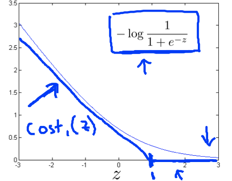
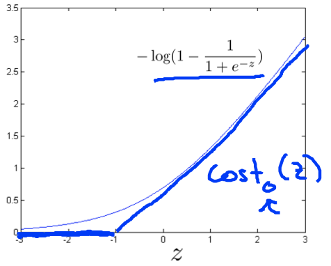
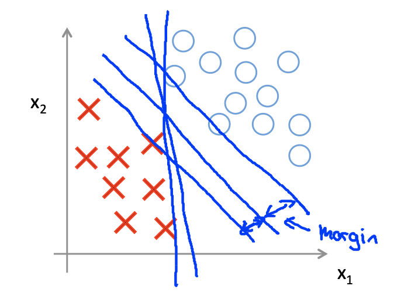
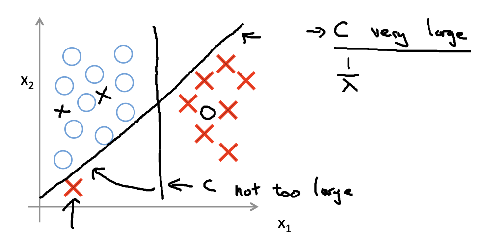

#### 1. Optimization Objective

* $$
  \min_\theta C \sum_{i=1}^m\left[y^{(i)}cost_1(\theta^Tx^{(i)}) + (1-y^{(i)})cost_0(\theta^Tx^{(i)})\right] + \frac{1}{2}\sum_{i=1}^n\theta_J^2
  $$

* $z = \theta^Tx$

*  

* if $y = 1$, $\theta^Tx \ge 1$

  if $y=0$, $\theta^Tx\le -1$

#### 2. Decision Boundary

* $$
  \begin{align*}
  & \min_\theta \frac{1}{2}\sum_{i=1}^n\theta_j^2\\
  & s.t.\quad \theta^Tx^{(i)} \ge 1\quad \text{if}\ y^{(i)} = 1\\
  & \quad \quad\ \ \ \theta^Tx^{(i)} \le -1\quad \text{if}\ y^{(i)} = 0
  \end{align*}
  $$

* Linearly Separable case

  

* 

#### 3. Kernel

* Given $x$, compute new feature depending on proximity to landmarks $l^{(1)}, l^{(2)}, l^{(3)}, \cdots$

* $f_1 = similarity(x, l^{(1)}) = \exp\left(-\frac{\Vert x-l^{(1)}\Vert^2}{2\sigma^2}\right)$

  if $x \approx l^{(1)}: f_1 \approx \exp\left(-\frac{0^2}{2\sigma^2}\right) \approx 1$

  If $x$ is far from $l^{(1)}: f_1 = \exp\left(-\frac{(\text{large number})^2}{2\sigma^2}\right) \approx 0$

* **SVM with Kernels**

  * Given $(x^{(1)}, y^{(1)}), (x^{(2)}, y^{(2)}), \cdots, (x^{(m)}, y^{(m)})$

  * Choose $l^{(1)} = x^{(1)}, l^{(2)} = x^{(2)}, \cdots, l^{(m)} = x^{(m)}$

  * Given example $x$:

    * $f_1 = similarity(x, l^{(1)})$
    * $f_2 = similarity(x, l^{(2)})$
    * $\cdots$

  * For training example $(x^{(i)}, y^{(i)})$

    * $x^{(i)}\rightarrow {f_1^{(i)} = sim(x^{(i)}, l^{(1)})\\ \vdots \\ f_m^{(i)} = sim(x^{(i)}), l^{(m)}}$
    * $f^{(i)} = x^{(i)}\\f_0^{(i)} = 1$

  * Hypothesis: Given $x$, compute features $f\in R^{m+1}$

    * Predict "$y=1$" if $\theta^Tf \ge 0$

    * Training
      $$
      \min_\theta C \sum_{i=1}^m\left[y^{(i)}cost_1(\theta^Tf^{(i)}) + (1-y^{(i)})cost_0(\theta^Tf^{(i)})\right] + \frac{1}{2}\sum_{i=1}^n\theta_J^2
      $$

#### 4. SVM parameters

* $C(=\frac{1}{\lambda})$
  * Large $C$: Lower bias, high variance.
  * Small $C$: Higher bias, low variance.
* $\sigma^2$
  * Large $\sigma^2$: Features $f_i$ vary more smoothly. Higher bias, lower variance.
  * Small $\sigma^2$: Features $f_i$ vary less smoothly. Lower bias, higher variance.

#### 5. Logistic regression vs. SVMs

$n = \text{number of features }(x\in R^{n+1}), m = \text{number of training examples}$

* If $n$ is large (relative to $m$):
  * Use logistic regression, or SVM without a kernel ("linear kernel")
* If $n$ is small, $m$ is intermediate:
  * Use SVM with Gaussian kernel
* If $n$ is small, $m$ is large:
  * Create/add more features, then use logistic regression or SVM without a kernel
* Neural network likely to work well for most of these settings, but may be slower to train.
