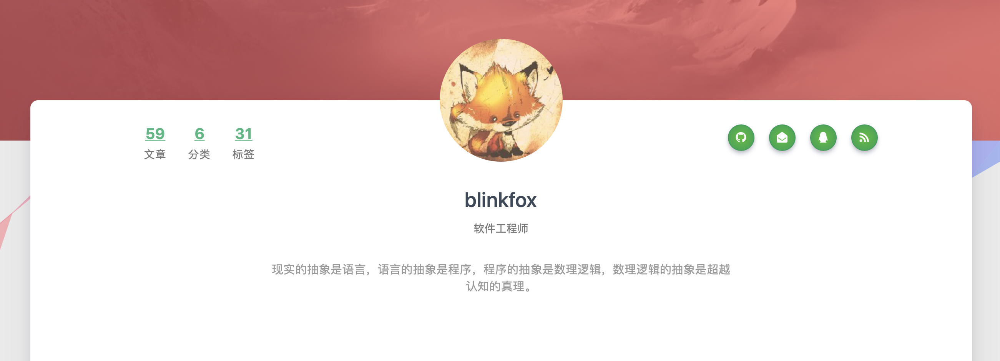
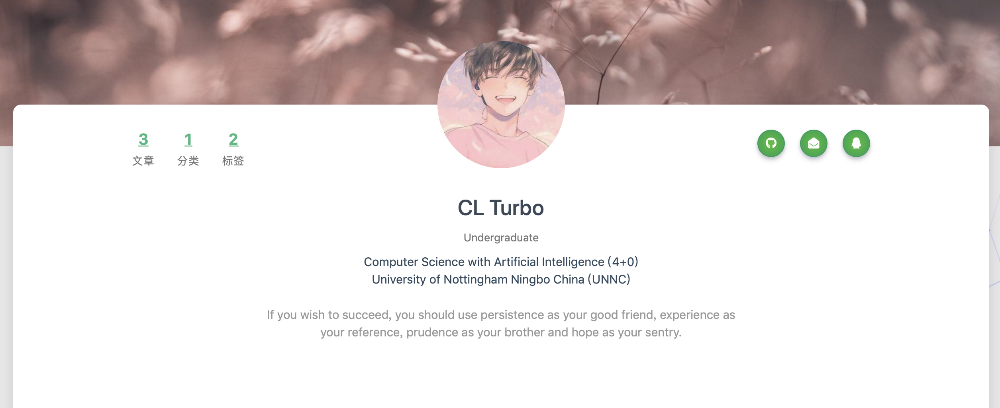

hexo-theme-matery下载与配置: <https://github.com/blinkfox/hexo-theme-matery>

### 1. 关于个人信息的添加及修改：

以自己的个人信息作说明：

原：

现：



首先找到`/hexo-theme-matery/layout/about.ejs` ，并找到代码如下：

```js
<div class="author"> //作者信息
    <div class="post-statis hide-on-large-only" data-aos="zoom-in-right">
        <%- partial('_partial/post-statis') %>
    </div> //引用另一个文件，表示的是左边文章、分类、标签以及他们的数量
    <div class="title"><%- config.author %></div> //作者名字，在blog/_config.yml中配置
    <div class="career"><%- theme.profile.career %></div> //作者职业，在/hexo-theme-matery/layout/about.ejs中配置
    <div class="social-link hide-on-large-only" data-aos="zoom-in-left">
    <%- partial('_partial/social-link') %>
    </div> //右边github、email、QQ等的链接，也可自己减少或增加
</div>
```

因此想要修改或增加自己的信息，需要在相应的配置文件里进行修改或增加。

比如我自己做的修改，首先打开`hexo-theme-matery`下的`_config.yml`文件，并找到`profile`属性，

```yml
profile:
  avatar: /medias/头像.jpg
  career: Undergraduate
  school: University of Nottingham Ningbo China (UNNC)
  major: Computer Science with Artificial Intelligence (4+0)
  introduction: If you wish to succeed, you should use persistence as your good friend, experience as your reference, prudence as your brother and hope as your sentry.
```

在`profile`里修改了头像，职业，以及新增了学校和专业。

那么该如何将这些特性在网页里显示出来呢？我们需要在上面说的`about.ejs`这个文件里做相应的修改。

```
<div class="title"><%- config.author %></div>
<div class="career"><%- theme.profile.career %></div>
<div class="major"><%- theme.profile.major %></div>
<div class="school"><%- theme.profile.school %></div>

```

只要加几个`div`块元素，就能显示你的其他信息。


### 2. Post封面图片的修改

先找到`/hexo-theme/matery/layout/_partial/post_cover.ejs`中的代码

```js
if (page.img) {
    featureimg = url_for(page.img); // 如果设置了img属性，那么封面图片就是你设置的图片
} else {
    var hashCode = function (str) {
        if (!str && str.length === 0) {
            return 0;
        }

        var hash = 0;
        for (var i = 0, len = str.length; i < len; i++) {
            hash = ((hash << 5) - hash) + str.charCodeAt(i);
            hash |= 0;
        }
        return hash;
    };

    var len = theme.featureImages.length;
    var num = Math.abs(hashCode(page.title) % len);

    featureimg = theme.jsDelivr.url
            ? theme.jsDelivr.url + url_for(theme.featureImages[num])
            : url_for(theme.featureImages[num]);
} // 否则将会采用作者的算法，根据title的长度来计算hashcode，再根据hashcode从默认的图片中选出一张。如果两篇文章的title都是四个字，那这两篇的封面就是同一张图片。
```

根据代码可知，想要一篇post用特定的图片，就必须设置这篇post的img属性。如下


可将图片移至`hexo-theme-matery/source/medias/featureimages`下，并将img属性设置为`/medias/featureimages/‘图片名’`即可。